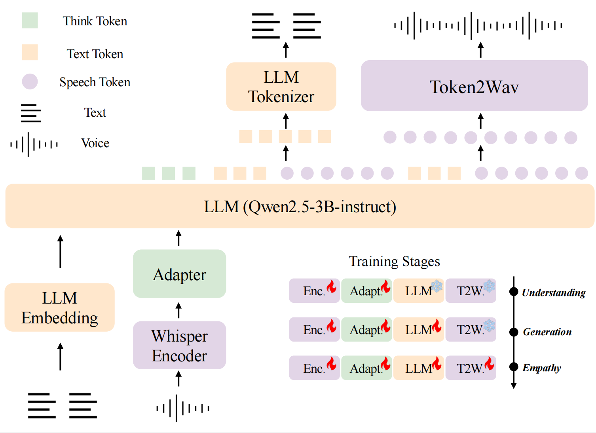

   <h1>OSUM-EChat: Enhancing End-to-End Empathetic Spoken Chatbot via Understanding-Driven Spoken Dialogue</h1>

Xuelong Geng, Qijie Shao, Hongfei Xue, Shuiyuan Wang, Hanke Xie, Zhao Guo, Yi Zhao, Guojian Li, Wenjie Tian, Chengyou Wang, Zhixian Zhao, Kangxiang Xia, Ziyu Zhang, Zhennan Lin, Tianlun Zuo, Mingchen Shao, Yuang Cao, Guobin Ma, Longhao Li, Yuhang Dai, Dehui Gao, Dake Guo, Lei Xie

    

 <a href="https://www.osum-echat.npu-aslp.org/"> Test Page</a> </a>&nbsp
 
📑 <a href="https://www.arxiv.org/abs/2508.09600">Paper</a> &nbsp&nbsp | &nbsp&nbsp 📑 <a href="https://aslp-lab.github.io/osum-echat.github.io/">Demo</a> &nbsp&nbsp | &nbsp&nbsp 💬 <a href="raw/fig/wechat.png">WeChat (微信)</a>&nbsp&nbsp 

Empathy is crucial in enabling natural interactions within spoken dialogue systems, 
allowing machines to recognize and respond appropriately to paralinguistic cues such as age, gender, and emotion. R
ecent advancements in end-to-end speech language models, which unify speech understanding and generation, provide promising solutions. 
However, several challenges persist, including an over-reliance on large-scale dialogue datasets, insufficient extraction of paralinguistic cues vital for conveying empathy, and the lack of empathy-specific datasets and evaluation frameworks.
To address these issues, we introduce OSUM-EChat, an open-source, end-to-end spoken dialogue system designed to enhance empathetic interactions, particularly in resource-limited settings.
Based on [OSUM](https://github.com/ASLP-lab/OSUM/tree/main/OSUM), OSUM-EChat introduces two key innovations: (1) a three-stage understanding-driven spoken dialogue training strategy that extends the capabilities of a large speech understanding model to spoken dialogue tasks, and (2) a linguistic-paralinguistic dual thinking mechanism that integrates paralinguistic understanding through a chain of thought with dialogue generation, enabling the system to produce more empathetic responses. This approach reduces reliance on large-scale dialogue datasets while maintaining high-quality empathetic interactions. Additionally, we introduce the EChat-200K dataset, a rich corpus of empathetic speech-to-speech dialogues, and the EChat-eval benchmark, a comprehensive framework for evaluating the empathetic capabilities of dialogue systems. Experimental results demonstrate that OSUM-EChat outperforms end-to-end spoken dialogue models regarding empathetic responsiveness, validating its effectiveness.
## Architecture

The overview of the architecture and tasks of OSUM-EChat.

    

